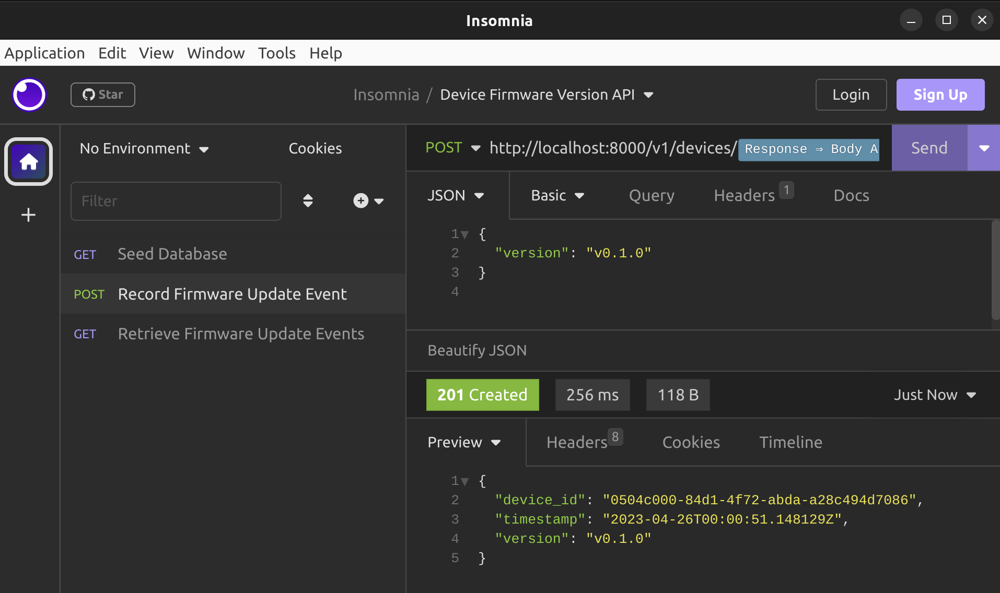

# Device Firmware Version API

This repository contains a Django API project which allows IoT devices to record their current firmware version in CockroachDB.

## Quickstart

This repository has a `docker-compose` file, which you can use to run both the database and the API.

```bash
docker-compose up --build
```

If you'd prefer to run the project locally, you will need to have docker-compose, python (version 3.11 or later), and poetry.

```bash
# Start the database
docker-compose up -d db

# Install the project dependencies
poetry install

# Run the DB migrations
poetry run src/manage.py migrate

# Start the API
poetry run src/manage.py runserver "localhost:8000"
```

Once running, you can invoke the API using its currently supported endpoints:

- `POST /v1/seed`
- `POST /v1/devices/{id}/firmware_version`
- `GET /v1/devices/{id}/firmware_version`

## Example Usage

This section demonstrates the usage of this API using [Insomnia](https://insomnia.rest/), which is my current favorite REST API client. This repository also contains the [Insomnia Collection](Example%20Insomnia%20Collection.json) used in this demonstration, which you can use to follow along.

This API currently does not have any self-service endpoints which would allow end-users to manage their user accounts, projects, devices, and API keys. As a stand-in, the API has a `POST /v1/seed` endpoint, which seeds the database with the following resources:

- a new project named "Test Project",
- a new project API key, which is associated with the project,
- a new device, which is associated with the project, and
- a new device API key, which is associated with the device.


> **Note:** The API key secrets returned by this endpoint are randomly generated, and the API only stores the hashes in the database. Once lost, they cannot be recovered.

The API's `POST /v1/devices/{id}/firmware_version` endpoint allows devices to upload their current version string to the database. This endpoint requires the device's ID, a JSON blob containing a "version", and the device's API key supplied using Basic Auth.



The API's `GET /v1/devices/{id}/firmware_version` endpoint allows members of the device's project to retrieve all of the firmware version strings that the device ever uploaded to the API. This endpoint requires the device's ID, as well as an API key that is associated with the project. This endpoint expects the project API key ID and secret to be supplied using Basic Auth.


## Database Schema

I deviated slightly from the database schemas given in the prompt. Please see [the revised schema DBML file](schemas.dbml), and the rendered diagram below.


The biggest deviation was dropping the "project_memberships" table and attaching API keys directly to a single project. This creates a many-to-one relationship between project API keys and projects, as opposed to having a many-to-many relationship. For now, the simplification makes the limited feature scope easier to implement.

The other changes that I made to the schema include:

- Adding a "device_firmware_update_events" table, which stores the device firmware version information uploaded by devices.
- Changing all `int` ID fields to `uuid` fields. This will help prevent resource enumeration attacks and allow the system to more easily distribute the creation of new entities.
- Changing all "secret" fields from "text" fields to "byte array" fields, so the API can store bcrypt hashes of the API key secrets, as opposed to storing the secrets in plaintext.

## Technology Choices

**For the API**, I chose Django as the web application framework. I chose Django because I've been meaning to get experience with it. I've heard it's a great tool for managing complexity in large web app projects and that it can also manage the database migrations for the project.

While I've had no experience with Django prior to working on this project, I have had prior experience with other web application frameworks, including:

- Flask (Python)
- ASP.NET (C# .NET Framework / C# .NET Core)
- NestJS (Typescript/Javascript)

**For the database**, I chose CockroachDB. The reasoning for this is that it claims to be a fully Postgres-compatible "NewSQL" database, which can much more easily be partitioned across multiple data nodes. I have a fair amount of prior experience with Postgres, but I had not previously had any experience with CockroachDB. I unfortunately did not get a chance to test its table partitioning functionality.

## Dependencies

`django`: As described in the **Technology Choices** section, this project uses Django as the web application framework. This project also leverages Django's ORM support for interacting with CockroachDB.

`psycopg2-binary` and `django-cockroachdb`: These dependencies allow Django's ORM to interact with CockroachDB.

`djangorestframework`: This dependency is mostly used to add serializers for each of the core models. This makes it easier to serialize each model to and from JSON. This also made it easier to exclude the `secret_hash` fields from being serialized.

`bcrypt`: This dependency allows the API to use bcrypt to store API key secret hashes and verify API key secrets.

## Future Work

**Terraform deployment.** I didn't write any Terraform, but I would if the project is eventually deployed into a cloud environment.

**Better secrets management.** The project's settings script (`src/device_firmware_version_api/settings.py`) should load database connection information and other secrets from environment variables as well as a secrets management service such as Vault or AWS SecretsManager.

**OpenAPI specification.** An OpenAPI (aka Swagger) specification would be useful for describing an explicit contract between the API and any frontends/SDKs that depend on the API. It may also be useful to generate data classes based on the OpenAPI spec and expose those in the Django views as opposed to directly exposing the DB models via the serializers from `restframework`. Having this layer of insulation would allow developers to make breaking changes to the database schema, while still supporting the `/v1/` API.

**Better authentication.** Currently the application uses basic auth, meaning the service has to validate passwords with bcrypt on every request. It would probably be beneficial to use a dedicated login endpoint, which takes a requester's ID and secret, and returns an OAuth 2.0 token as a JWT.

**Running database migrations in CI.** Currently, the API container runs the database migrations against the database on startup before starting the Django application server. Database migrations are something that should happen as part of a CI process instead.

**Additional self-service features.** This API would also benefit from having a whole host of additional features related to managing users, devices, projects, and API keys:

- Users should be able to self-signup to create an account.
- Users should be able to create a new project. Users should automatically be the admin of that new project.
- Users should be able to invite new members to their project. Additionally, project membership should also have a "role".
- Users should be able to create and delete API keys which share their role.
- Users should be able to create and delete API keys for the devices they can access through the projects that they're members of.
