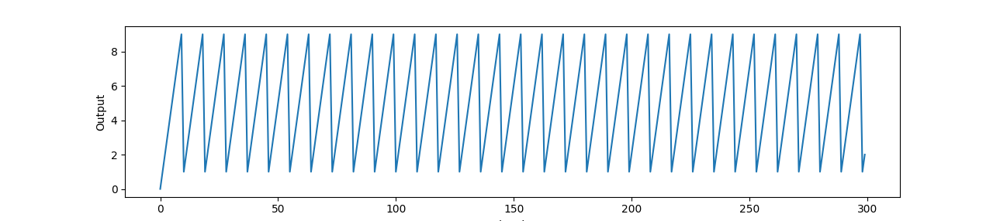

# Add Digits

https://leetcode.com/explore/challenge/card/july-leetcoding-challenge/547/week-4-july-22nd-july-28th/3402/

Given a non-negative integer `num`, repeatedly add all its digits until the
result has only one digit.

## Example

```
Input: 38
Output: 2 
Explanation: The process is like: 3 + 8 = 11, 1 + 1 = 2. 
             Since 2 has only one digit, return it.
```

## Follow up

Could you do it without any loop/recursion in `O(1)` runtime?

## Hints and Solution

It's fairly trivial to solve this problem naively using some combination of
division/modulo summing or by converting the number to a string, then iterating
over the characters in the string and summing them as integers. The hints and
follow-up make reference to an optimized, closed-form solution.

Two of the provided hints asked

> What are all the possible results? How do they occur, periodically or
> randomly?

If you solve this problem by any means and plot the output, you can see a clear
sawtooth pattern, which typically indicates that the solution might involve some
modulus operation. I used `matplotlib.pyplot` for this demo

```python
import matplotlib.pyplot as plt
import app

solution = app.Solution()
data = [solution.addDigits(n) for n in range(300)]

plt.plot(data)
### [<matplotlib.lines.Line2D object at 0x7f0dd10e63d0>]
plt.xlabel("Input")
### Text(0.5, 0, 'Input')
plt.ylabel("Output")
### Text(0, 0.5, 'Output')
plt.show()
```



The problem also provided a hint that led to a wikipedia article on the concept
of a "Digital Root", which contains a set of equations to solve this problem
given any base. For this problem, base 10 (`b = 10`) is assumed.


