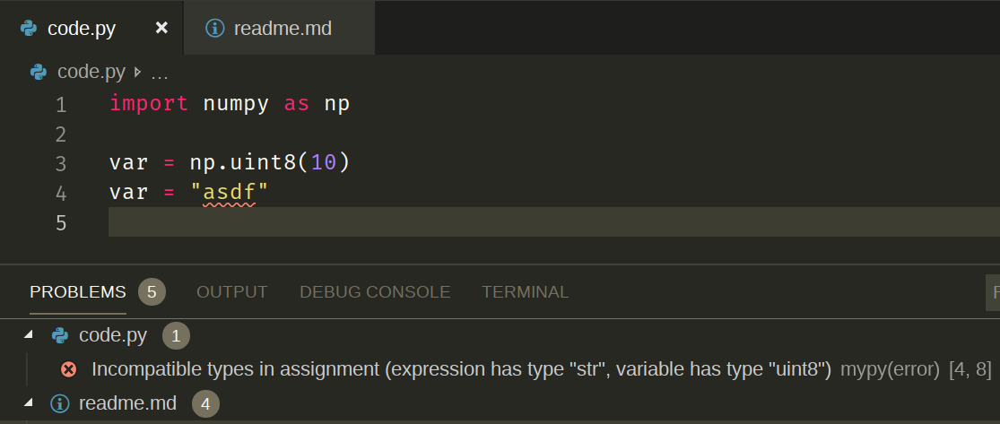

# MyPy Example Usage with Numpy

In an attempt to help someone out with getting "python type hints with NumPy
data types" working in VS Code, I set up this repository.

## Python Version

I used Python 3.5 when setting up this demo.

## `stubs/`

This directory contains a copy of [https://github.com/numpy/numpy-stubs](https://github.com/numpy/numpy-stubs),
which contains stub files for NumPy. These files will be used by MyPy when
evaluating code files. Instructions for adding this resource via bash are below.

```bash
mkdir stubs && cd stubs
wget https://github.com/numpy/numpy-stubs/archive/master.zip
unzip master.zip && rm master.zip
mv numpy-stubs-master/numpy-stubs/ ./numpy
rm -r numpy-stubs-master
```

According to the repository in its current state

> It will be released as a separate "numpy-stubs" package on PyPI per PEP 561.
> This will let us iterate rapidly on experimental type annotations without
> coupling to NumPy's release cycle.
>
> ...
>
> Eventually, once development has stabilized, we expect to merge these type
> stubs into the main NumPy repository.

From what I can tell, it appears that neither of these 2 things have happened.
Downloading the resources directly is the best way I found to incorporate the
stubs as part of this repository.

## `mypy.ini`

This is the default configuration file for MyPi.
[This sentence links to the reference for this config file.](https://mypy.readthedocs.io/en/latest/config_file.html#the-mypy-configuration-file)
The only configuration that has been added is the `mypy_path`, which operates
similarly to the `MYPYPATH` environment variable, instructing MyPy as to where
it should load stubs from.

## `.vscode/settings.json`

In this file, I had to set up a few arguments to enable and configure MyPy. The
only argument that I changed from the "default" configuration was
`"--config-file=${workspaceFolder}/mypy.ini"`, which allows MyPi to load the
`mypy.ini` config file regardless of which file you're editing.
[This may not be necessary in the future.](https://github.com/microsoft/vscode-python/issues/6678)

## Output


