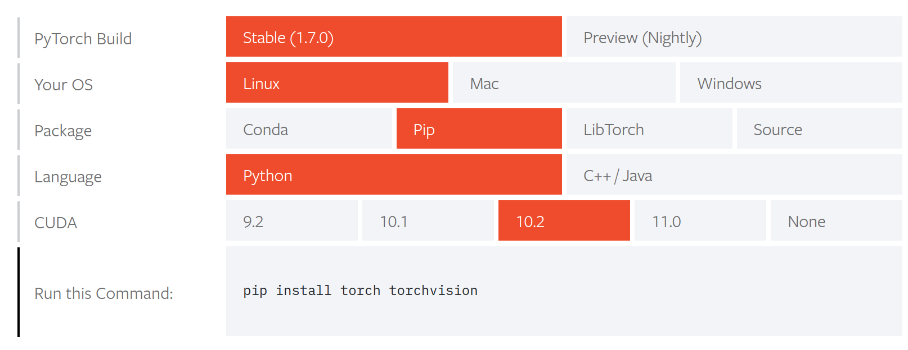

# Pytorch Getting Started

https://www.youtube.com/watch?v=Rtmi-H-mlKw

## Installing

Getting started is pretty easy with pip.



Verification:

```python
# Check to make sure pytorch is working
import torch
print(torch.rand(3,5))
# tensor([[0.7605, 0.3859, 0.6797, 0.8334, 0.8003],
#         [0.7907, 0.9430, 0.5372, 0.8149, 0.9230],
#         [0.7414, 0.5163, 0.4480, 0.5441, 0.6845]])

# Optional, check for cuda
print(torch.cuda.is_available())   # True
print(torch.cuda.is_initialized()) # False
torch.cuda.init()
print(torch.cuda.is_initialized()) # True
```

## Spyder

The course instructor recommends using Spyder as the IDE for pytorch projects. Spyder recommends installing via Anaconda, but we're all about breaking rules around here. Their [releases page on GitHub](https://github.com/spyder-ide/spyder/releases) mentions that you can `pip install -U spyder`.
