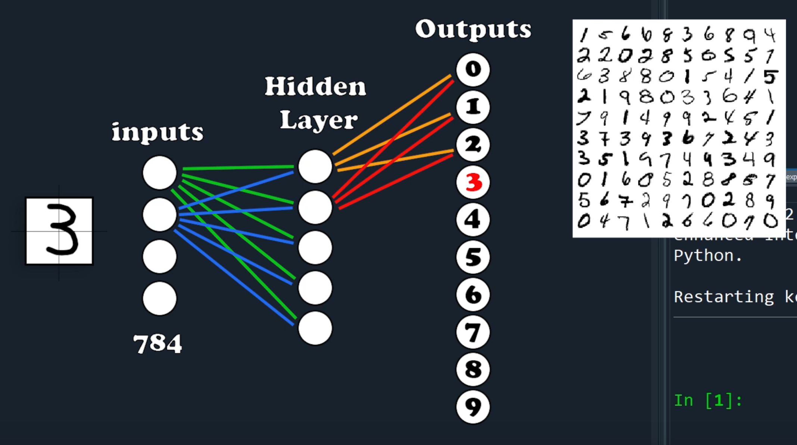

# Basic Feed Forward Network

The first assignment is to create a basic network like the one pictured above. We're going to essentially convery 28px by 28px images of hand-drawn numbers to a 1D array of pixels, pass those to the network, train the network, then hopefully the output layer (10 nodes) will indicate the number passed in.

Epoch: Number of times that data is passed through a neural network. Good practice to shuffle data per epoch. Also allows for batch sizes.
