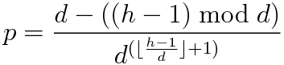

# Challenge #271 [Easy] Critical Hit


Critical hits work a bit differently in this RPG. If you roll the maximum 
value on a die, you get to roll the die again and add both dice rolls to get 
your final score. Critical hits can stack indefinitely -- a second max value 
means you get a third roll, and so on. With enough luck, any number of points 
is possible. 


### Input

| Variable | Purpose |
|-|-|
|`d`|The number of sides on your die.|
|`h`|The amount of health left on the enemy.|

### Output

The probability of you getting h or more points with your die.

### Examples

| Input: d | Input: h | Output      |
|----------|----------|-------------|
| 4        | 1        | 1           |
| 4        | 4        | 0.25        |
| 4        | 5        | 0.25        |
| 4        | 6        | 0.1875      |
| 1        | 10       | 1           |
| 100      | 200      | 0.0001      |
| 8        | 20       | 0.009765625 |

### Implementation

This challenge was completed with Lua. I chose Lua, because I wanted to learn. 

The probability `p` of killing an enemy with health `h` with a `d` sided die is 
modeled by the following equation.



In Lua:

```lua
function probability (h, d)
    local overflow = math.floor((h - 1) / d)
    local remaindr = (h - 1) % d
    return (d - remaindr) / (d ^ (overflow + 1))
end
```

### Usage

This was implemented as a command line module, accepting the two parameters 
`d` and `h` as arguments. The module calculates the result as a decimal 
percentage, but reports the result as a natural percentage for readability. 

```
$ lua .\CritKillProbCalc.lua 4 5
25%
$ lua .\CritKillProbCalc.lua 100 200
0.01%
$ lua .\CritKillProbCalc.lua 8 20
0.9765625%
```

### `Probability (x, x) = Probability (x, x+1)`

If the Enemy's remaining health (`h`) is equal to the max damage of your 
player's weapon (`d`), then the probability of defeating the enemy in one hit 
is `1/d`, since you have to roll the max value perfectly. 

If the Enemy's remaining health (`h`) is equal to `d+1`, then the probability 
of defeating the enemy in one hit is also `1/d`. This is because your player 
must roll the max value of the weapon in order to roll over to the next damage 
bracket, which then triggers a second roll where the enemy only has one health 
remaining. 

This means that the probability of killing an enemy when `h=d+1` is the same as 
the probability of killing the enemy when `h=d`.

### Bug Where `d = 1` 

If your player's weapon can only do one damage (`d=1`), then every attack will 
kill any enemy regardless of `h`. This is because every attack roll would be 
considered a critical hit, which would cause the dice to be rolled again. This 
also means that the RNG will have to pick a random number between 1 and 1, `h` 
times per enemy, which could further impact game playability and performance. 
